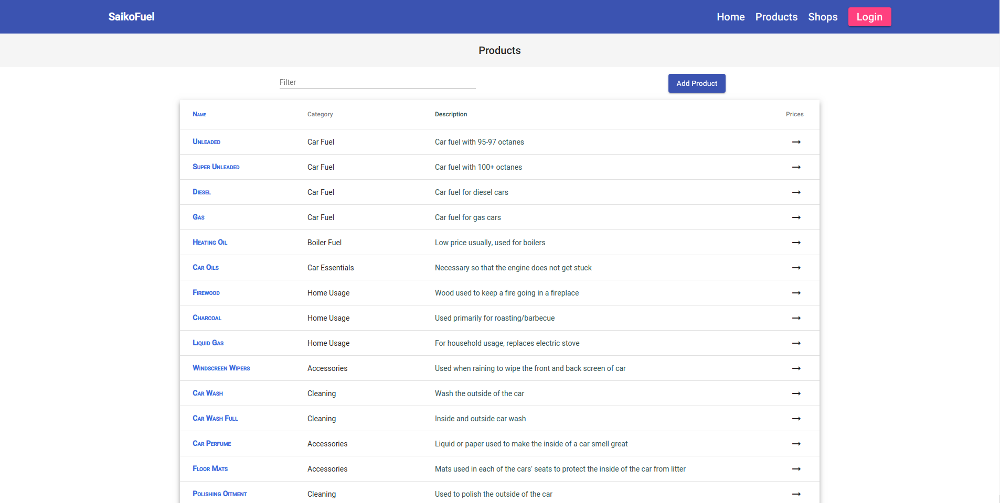
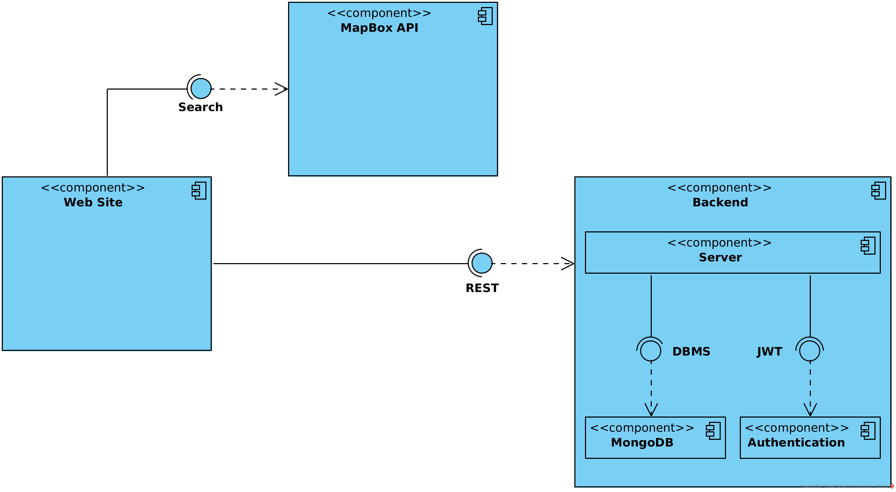

Our project for the module "Software Engineering" (9th semested ECE NTUA). A web platform for crowdsourcing products of gas stations using MongoDB, nodeJS (backend) and AngularJS (frontend).

The members of the team are (in alphabetical order):

* [Dimitriadis Nikolaos](https://github.com/nik-dim)
* [Dontas Spyros](https://github.com/xspirus)
* [Leraj Thanas](https://github.com/thanasislerai)
* [Papayfantis Vasilis](https://github.com/papayfantisv)
* [Tsiourvas Asterios](https://github.com/asterios-tsiourvas)
* [Tzavaras Stefanos](https://github.com/steftzav)


# REST API

## Endpoints and Authorized

Here we have the Endpoints for our REST API and who is authorized for each one. We are using HTTPS methods (GET,POST,...) and the baseURL of our application is:

_{baseURL} = https://localhost:8765/observatory/api_

* 0 -> Admin
* 1 -> Admin, User
* 2 -> All

| URL                | GET(all) | GET  | POST | PUT  | PATCH | DELETE |
| ------------------ | :------: | :--: | :--: | :--: | :---: | :----: |
| {baseURL}/prices   |    2     |  2   |  1   |  1   |   1   |   1    |
| {baseURL}/products |    2     |  2   |  1   |  1   |   1   |   1    |
| {baseURL}/shops    |    2     |  2   |  0   |  1   |   1   |   1    |
| {baseURL}/signup   |    -     |  -   |  2   |  -   |   -   |   -    |
| {baseURL}/login    |    -     |  -   |  1   |  -   |   -   |   -    |
| {baseURL}/logout   |    -     |  -   |  1   |  -   |   -   |   -    |
| {baseURL}/:userId  |    -     |  -   |  -   |  -   |   -   |   0    |

The Rest API uses [JWT](https://jwt.io/) authentication. 

## How to use authentication?

The authentication is specified in the header `X-OBSERVATORY-AUTH` where the following information is encoded:

* username
* role (Admin or User)
* password
* email

Depending on the role attribute, the visitor gains access to pages (see [API Endpoints](https://github.com/nik-dim/softeng/wiki/Authentication) for more information)

## Layers of Authentication

The JWT is stateless. When the user gets a token in Login, it's saved in the session so the user can access the pages depending on his role. This token, however, is discarded after Logout and also has an expiration time (1 hour). If the token expires, the user will need a new one (Login again) to proceed.

We use three layers of authentication:

### **"checkBlackList"**

Every time a token is discarded after logout, we save it in a list. Then, when someone needs a token, this function checks this list and if it has been used before, it returns an Error Message.

### **"checkAuth"**

If the token hasn't been used before, this function checks if it's valid and proceeds.

### **"authorize"**

Takes the role parameter and checks if the user is authorized to access this page (role = "User" and not "Admin" -> "Unauthorized role")

We used nodeJS to build our backend.


# Front-End

For the map's implementation we used the <a href="https://docs.mapbox.com/api/">Mapbox</a> API.  

The map that was generated looks like this:  


    

The green dots represent the gas stations. Let's see what happens if we click on one of them:  


As you can see, a popup shows up with the gas station's name. The name is a link which the user clicks and is redirected to the gas station's page to check the prices.  
There is also a geolocate button on the top right corner. When clicked, the user's location shows up as a blue dot and also a list with the 10 nearest gas stations on the left. This is also the case whenever a user enters a location in the geocoder on the top right.


A simple user can only view prices for a gas station. Let's see what privileges a logged in user has:


In the popup that appears, there is also a link which the logged in user clicks in order to add a product price for the specific gas station.

## Login

A user who is already registered can log in with this form:


The user enters his username and his password and presses Login. If the verification is successful, he is redirected to Home.

## Sign Up

If the user is not registered, he cliks on Sign up and this form appears:


Then the user needs to fill up this form with his email,username and password (required). If he wants, he can give his first name and/or last name (not required). The email must be a valid email address and the password must be at least 8 characters long.

After that he presses Sign Up and is redirected to Home, if the Sign Up was successful.


## Shops

By clicking on the shops tab on the top menu, the user is redirected to the page below:


The user can filter the shops that are displayed with the brand:


and/or the address:


The user can also click on the arrow-button to the right and will be redirected to a page where the products of this shop and their prices are displayed.


## Products

By clicking on the products tab on the top menu, the user is redirected to the page below.

  

There is a filtering option in the page. Let's see an example of how it works:

  

The products can be filtered either by their name or by their category.  
There is also an *Add Product* button. When a user is not logged in and clicks this button, he is redirected to the log in page. After he fills the log in form, he is then redirected to page that contains the below form:

  

After the user fills the form, he is redirected back to the products page.


# Backend

## Project Structure

```
backend_node
├── api
│   ├── controllers  / ...
│   ├── middleware
│   │   ├── authorize.js
│   │   ├── check-auth.js
│   │   ├── checkBlacklist.js
│   │   ├── errorHandler.js
│   │   └── parser.js
│   ├── models  / ...
│   └── routes  / ...
├── app.js
├── certificates / ...
├── nodemon.json
├── package.json
├── package-lock.json
├── server.js
└── statements.sql
```

## Database

We are using MongoDB, both local and online. We have chosen the free plan for this tool. Also, we are using the mongoose library, which implements event-driven non-blocking APIs for HTTP (client and server bulit-in protocols). 


### Class Diagram


### Entity-Relationship (ER) Diagram


# UML Diagrams

## Overview


## Interfaces

### Interfaces with external systems and applications



## User Interfaces


## Use Cases

Some very important use cases are presented below:

### Observer searches for a product 


### Volunteer registers a product


#### Volunteer logs in


#### Volunteer adds a Product


### Various Admin Actions


#### Admin logs in


#### Admin updates User


#### Admin deletes Store


#### Admin deletes User


